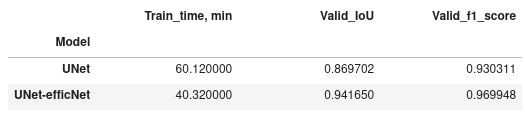

# UNet vs UNet-w-EfficientNet-backbone for satellite segmentation

## Main goal
Compare two types of NN (Neural Network) models for satellite  segmentation using the following criterias:
* IoU metric & f1-score
* training time for the same number of epochs (10)

## Models
Models to bring into comparison:
1) UNet
2) UNet with pretrained EfficientNet backbone

### UNet
Network that relies on the strong use of data augmentation to use the available annotated samples more efficiently. The architecture consists of a contracting path to capture context and a symmetric expanding path that enables precise localization. This network can be trained end-to-end from very few images.  

Original paper: https://arxiv.org/pdf/1505.04597

### UNet with EfficientNet backbone pretrained on Imagenet dataset
EfficientNets family resulted Convolutional Neural Networks scaling investigation (Mingxing Tan 1 Quoc V. Le). According to the authors there are many ways to scale a ConvNet for different resource constraints: 
* ResNet (He et al., 2016) can be scaled down (e.g., ResNet-18) or up (e.g., ResNet-200) by adjusting network depth (#layers), 
* while WideResNet (Zagoruyko & Komodakis, 2016) and MobileNets (Howard et al., 2017) can be scaled by network width (#channels). 
* It is also well-recognized that bigger input image size will help accuracy with the overhead of more FLOPS.

Original paper: https://arxiv.org/pdf/1905.11946.

In this work the lightest efficientnet-b0 (4M params) was used as pretrained backbone to extract features of different spatial resolution for UNet.  

## Data description

The original dataset (https://github.com/Yurushia1998/SatelliteDataset) - A satellite dataset for object detection and segmentation using both synthesis and real satellite images.
* This dataset include 3116 images, mask with size 1280x720 and bounding boxes of both synthesis and real satellite images. Each satellite is segmented into at most 3 parts, including body, solar panel and antena by respectively 3 color: green,red,blue.
* Image with index 0-1002 has fine mask while images from index 1003-3116 has coarse masks.
* The datasets is divided into 2 parts: train data including 403 fine mask from index 0-402 and 2114 coarse mask from index 1003-3116. The val dataset includes 600 images with fine mask indexed from 403 to 1002.
* File all_bbox.txt include bounding boxes of all satellites inside datasets based on segmentation masks in form of a dictionary with index of images as key. Each bounding boxes has format [max_x,max_y,min_x,min_y].

## Metrics

Dice score (F1 score) and Jaccard score (Intersection over Union score)
* The Dice score is calculated as two times the overlap between the predicted segmentation mask and the Ground Truth mask divided by the total pixels in both the masks
* IoU score is calculated by dividing the overlap between the Ground Truth segmentation mask and the predicted mask by the total pixels in the Ground Truth and the predicted masks.

### Important terms

***Imagenet dataset***

The ImageNet dataset contains 14,197,122 annotated images according to the WordNet hierarchy. Since 2010 the dataset is used in the ImageNet Large Scale Visual Recognition Challenge (ILSVRC), a benchmark in image classification and object detection
* Total number of non-empty WordNet synsets: 21841
* Total number of images: 14197122
* Number of images with bounding box annotations: 1,034,908
* Number of synsets with SIFT features: 1000
* Number of images with SIFT features: 1.2 million

Original paper: https://arxiv.org/pdf/1409.0575

***SIFT***

SIFT (Scale Invariant Feature Transform) Detector is used in the detection of interest points on an input image. Unlike the Harris Detector, which is dependent on properties of the image such as viewpoint, depth, and scale, SIFT can perform feature detection independent of these properties of the image. This is achieved by the transformation of the image data into scale-invariant coordinates. The SIFT Detector has been said to be a close approximation of the system used in the primate visual system.

## Summary

Two models based on UNet were compared in satellites segmentation task.
As expected, UNet with EfficientNet-b0 backbone (4M, params; pretrained on Imagenet) significantly outperformed base UNet acccording to all criterias designated, after only 10 epochs training:
    
    * It works 1.5 times faster than the base model, on the same hardware configuration; 
    * it showed significantly better values ​​for all metrics;

How to improve results:

1) Scaling EfficientNet backbone to HW resource constraints
2) Increasing training epochs number
3) Another NN architecture + encoder combination should be tested too

  
## Libraries & tools used
* see the requirements
